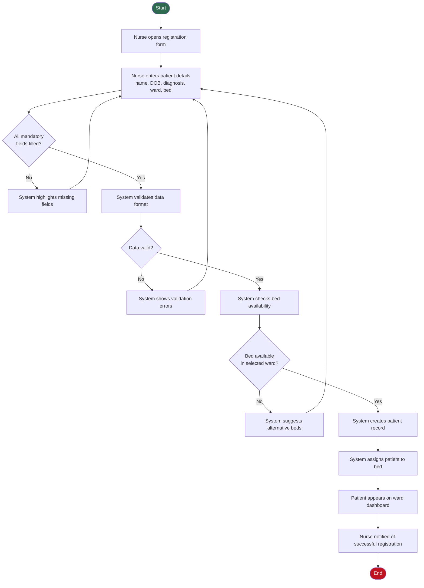
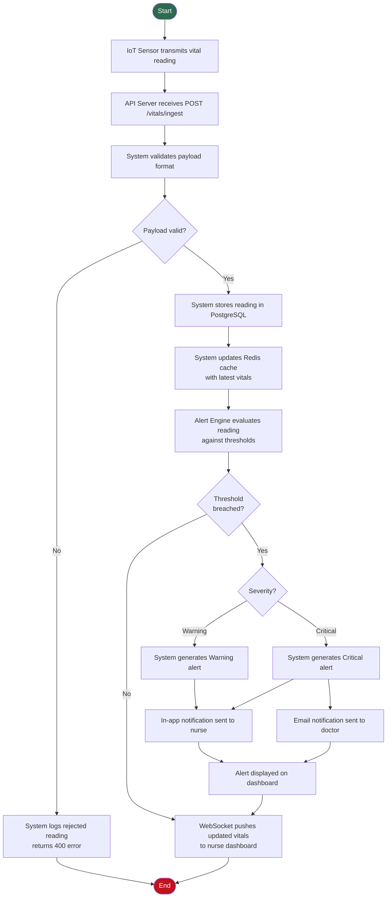
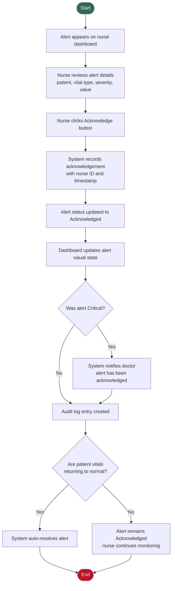
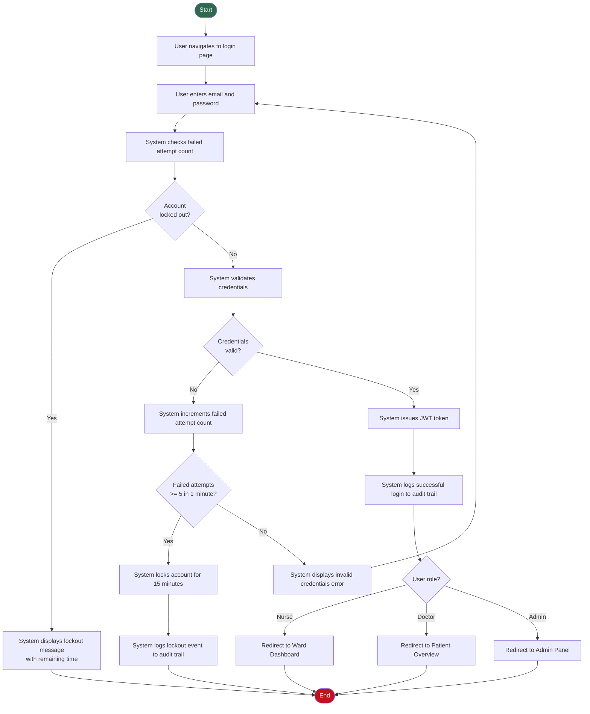
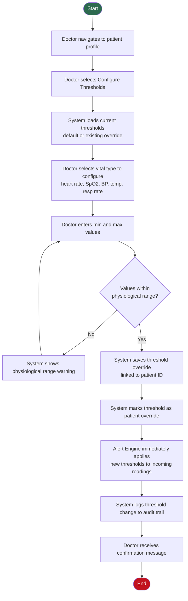
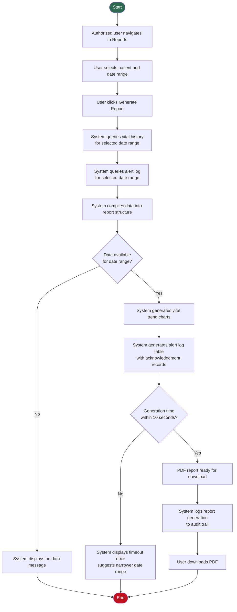
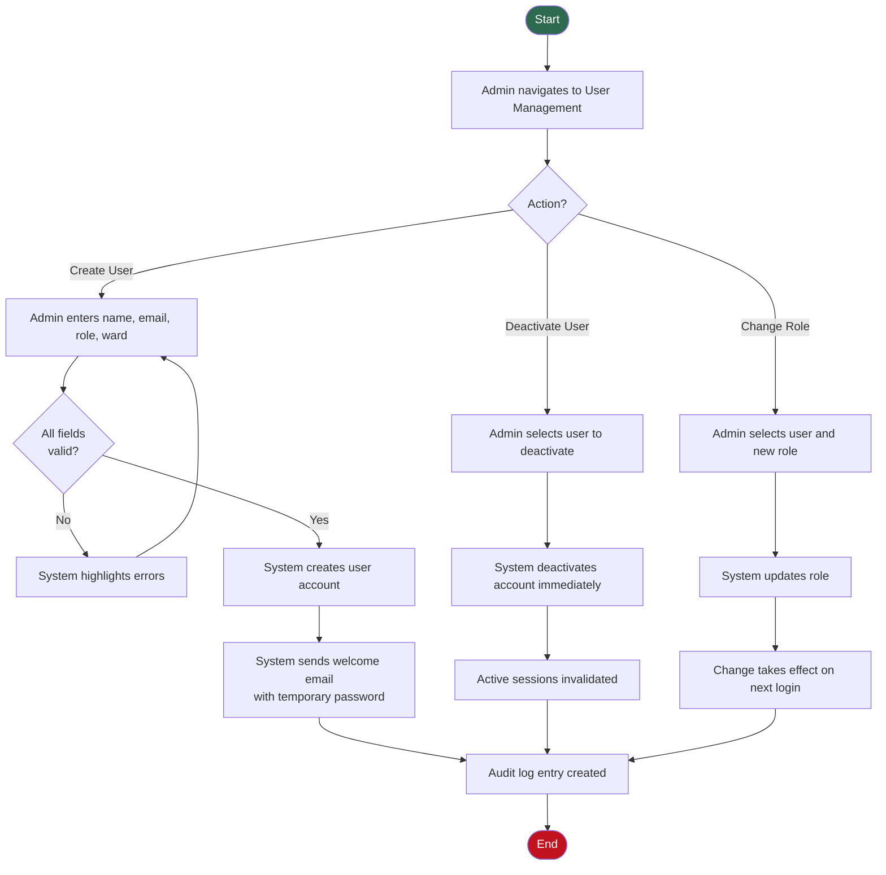
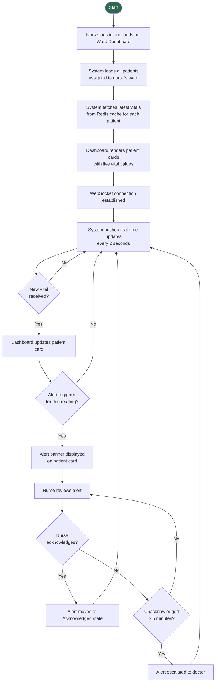

# ACTIVITY_DIAGRAMS.md — Activity Workflow Modeling
## Hospital Patient Monitoring System (HPMS)

> Traces to: [SRD.md](./SRD.md) | [STAKEHOLDERS.md](./STAKEHOLDERS.md) | [AGILE_PLANNING.md](./AGILE_PLANNING.md)

---

## 1. Patient Registration Workflow

### Explanation
This workflow maps to **FR-01 (Patient Registration)** and **US-001**. The decision nodes handle the two most common failure points: incomplete form submission and unavailable beds. Parallel to record creation, the ward dashboard updates in real time — addressing the Ward Manager's concern for live occupancy visibility (STAKEHOLDERS.md).

**Stakeholder addressed:** Nurse (primary actor), Ward Manager (dashboard update)
**Sprint Task:** T-006, T-007

---

## 2. Vital Signs Ingestion and Alert Generation Workflow

### Explanation
This is the core end-to-end workflow of HPMS, mapping to **FR-02, FR-05, FR-06** and **US-002, US-003, US-007**. The parallel actions — in-app notification to nurse AND email to doctor for critical alerts — directly address the doctor's pain point of missing critical updates when off-system.

**Stakeholder addressed:** Nurse (in-app alert), Doctor (email notification), Ward Manager (dashboard)
**Sprint Tasks:** T-008, T-009, T-010, T-011, T-014, T-015

---

## 3. Alert Acknowledgement Workflow

### Explanation
Maps to **FR-07 (Alert Acknowledgement)** and **US-004**. The audit log entry on every acknowledgement directly addresses the Compliance Officer's requirement for a traceable record of all clinical responses. The doctor notification on critical acknowledgement closes the communication loop between nurses and doctors.

**Stakeholder addressed:** Nurse (primary actor), Doctor (notification), Compliance Officer (audit)
**Sprint Task:** T-016

---

## 4. User Login and Authentication Workflow

### Explanation
Maps to **FR-09 (Role-Based Access)**, **NFR-SE02, NFR-SE03** and **US-009, US-012**. The role-based redirect after login ensures each user sees only the interface relevant to their responsibilities — a key usability requirement. Account lockout after 5 failed attempts addresses the IT Staff and Compliance Officer's security concerns.

**Stakeholder addressed:** All users (primary), IT Staff (security), Compliance Officer (audit)
**Sprint Task:** T-003

---

## 5. Alert Threshold Configuration Workflow

### Explanation
Maps to **FR-04 (Configurable Alert Thresholds)** and **US-005**. The immediate application of new thresholds (step K) is critical — a doctor adjusting thresholds for a deteriorating patient needs the change to take effect on the next vital reading, not after a delay. The audit log entry addresses the Compliance Officer's need to track all clinical configuration changes.

**Stakeholder addressed:** Doctor (primary actor), Compliance Officer (audit trail)
**Sprint Task:** T-013

---

## 6. Report Generation Workflow

### Explanation
Maps to **FR-10 (Report Generation)** and **US-010**. The 10-second generation guard condition directly reflects the acceptance criteria in SRD.md. The parallel generation of vital charts and alert tables ensures the report is comprehensive for clinical review and handover documentation.

**Stakeholder addressed:** Doctor (clinical review), Hospital Administrator (compliance reporting), Compliance Officer (audit)
**Sprint Task:** Not in Sprint 1 — Could-have backlog item

---

## 7. User Account Management Workflow

### Explanation
Maps to **FR-09 (Role-Based Access Control)** and **US-009**. The immediate session invalidation on deactivation (step L) is a critical security requirement — a deactivated user must not be able to continue an active session. All three admin actions feed into the audit log, addressing the Compliance Officer's traceability requirement.

**Stakeholder addressed:** Admin (primary actor), IT Staff (security), Compliance Officer (audit)
**Sprint Tasks:** T-003, T-004, T-005

---

## 8. Ward Dashboard Monitoring Workflow

### Explanation
Maps to **FR-03 (Live Vitals Dashboard)**, **FR-05, FR-07** and **US-002, US-003, US-004**. This workflow captures the continuous, real-time nature of HPMS — unlike other workflows that have a clear end state, ward monitoring is a perpetual loop that only terminates when the nurse logs out. The 5-minute escalation path addresses the risk of a nurse missing a critical alert.

**Stakeholder addressed:** Nurse (primary actor), Ward Manager (overview), Doctor (escalation)
**Sprint Tasks:** T-010, T-011, T-012, T-015, T-016

---

## Traceability Summary

| Activity Diagram | Functional Requirements | User Stories | Sprint Tasks |
|---|---|---|---|
| Patient Registration | FR-01 | US-001 | T-006, T-007 |
| Vital Ingestion & Alert Generation | FR-02, FR-05, FR-06 | US-002, US-003, US-007 | T-008 to T-015 |
| Alert Acknowledgement | FR-07 | US-004 | T-016 |
| Login & Authentication | FR-09, NFR-SE02, NFR-SE03 | US-009, US-012 | T-003 |
| Threshold Configuration | FR-04 | US-005 | T-013 |
| Report Generation | FR-10, FR-12 | US-010, US-011 | — |
| User Account Management | FR-09, FR-12 | US-009, US-011 | T-003, T-004, T-005 |
| Ward Dashboard Monitoring | FR-03, FR-05, FR-07 | US-002, US-003, US-004 | T-010, T-011, T-012 |
