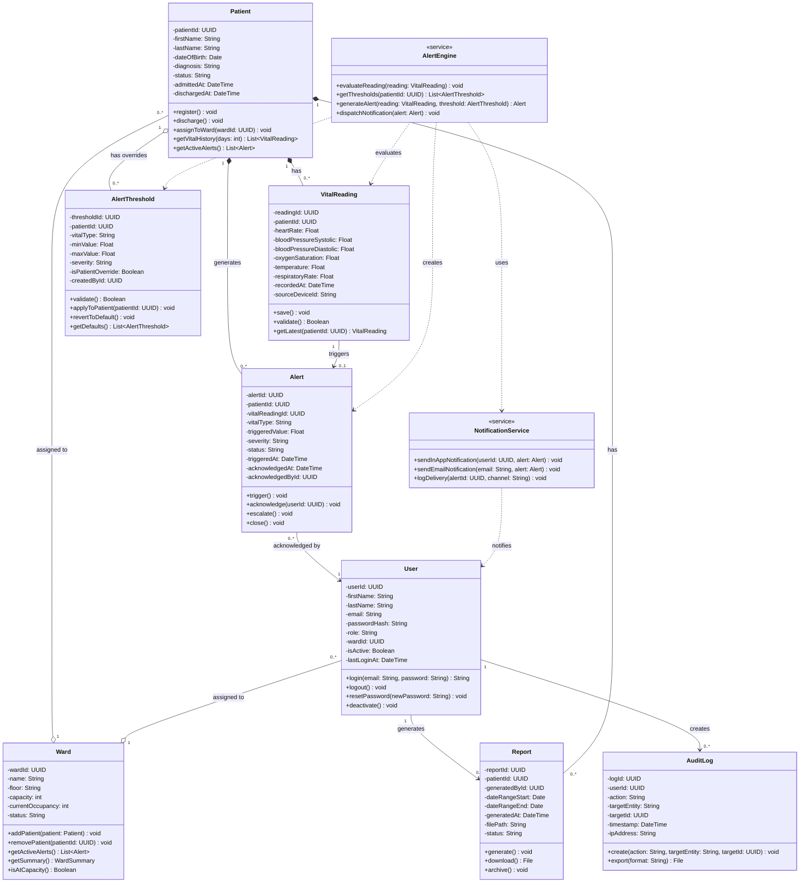
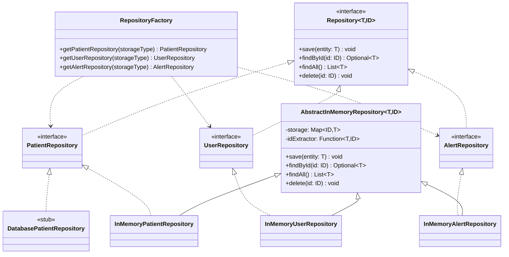

# CLASS_DIAGRAM.md — Class Diagram
## Hospital Patient Monitoring System (HPMS)

> Traces to: [DOMAIN_MODEL.md](./DOMAIN_MODEL.md) | [SRD.md](./SRD.md) | [STATE_DIAGRAMS.md](./STATE_DIAGRAMS.md)

---

## Class Diagram

---

## Key Design Decisions

### 1. Composition vs. Aggregation
**Patient → VitalReading** and **Patient → Alert** use **composition** (filled diamond) because vital readings and alerts are meaningless without the patient they belong to — if a patient record is deleted, all associated readings and alerts are deleted too.

**Patient → AlertThreshold** uses **aggregation** (open diamond) because thresholds can exist as system-wide defaults independent of any specific patient. A threshold configuration is not owned exclusively by one patient.

**Ward → Patient** uses **aggregation** because a patient can exist before being assigned to a ward and can be reassigned — the ward does not own the patient.

### 2. Service Classes
**AlertEngine** and **NotificationService** are modeled as service classes (marked with `<<service>>`) rather than entities. They have no persistent state — they perform operations on domain objects. This reflects the separation of concerns in the system architecture (ARCHITECTURE.md) where the Alert Engine is a distinct container.

### 3. Dependency (Dashed Arrow)
AlertEngine and NotificationService use **dependency** relationships (dashed arrows) to VitalReading, AlertThreshold, Alert, and User — they use these objects temporarily during method execution but do not own or store them.

### 4. Multiplicity
- `Patient "1" *-- "0..*" VitalReading` — one patient has zero or more vital readings
- `VitalReading "1" --> "0..1" Alert` — one reading triggers at most one alert
- `Alert "0..*" --> "1" User` — many alerts can be acknowledged by one user
- `Patient "0..*" --o "1" Ward` — many patients assigned to one ward

### 5. Alignment with Prior Assignments
- All 8 entities map directly to the domain model (DOMAIN_MODEL.md)
- Attributes match the database schema defined in ARCHITECTURE.md (Level 4 Code Diagram)
- Methods correspond to actions defined in activity diagrams (ACTIVITY_DIAGRAMS.md)
- Relationships enforce the business rules defined in DOMAIN_MODEL.md (BR-01 to BR-10)

---

## Repository Layer Diagram (Assignment 11)

