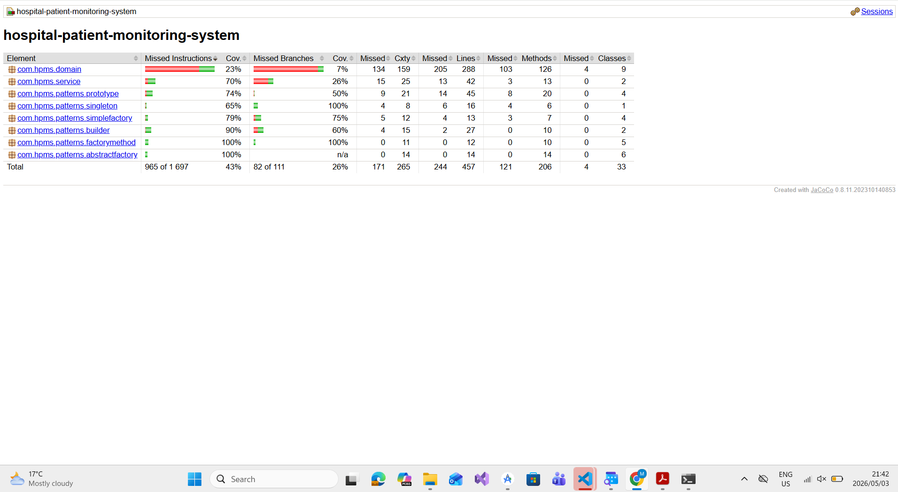

# 🏥 Hospital Patient Monitoring System (HPMS)

A real-time distributed system for continuous monitoring of patient vitals, alert generation, and clinical coordination across hospital wards. The system is designed to improve response time to patient deterioration, reduce manual monitoring overhead, and support data-driven clinical decision-making.

---

## 📌 Project Overview

The Hospital Patient Monitoring System (HPMS) enables healthcare professionals to:

- Continuously monitor patient vital signs in real time
- Receive immediate alerts when readings exceed safe thresholds
- Access patient history and trend data for clinical assessment
- Coordinate care across doctors, nurses, and administrative staff
- Maintain secure, role-based access to sensitive medical data

The system prioritises **patient safety, system reliability, and clinical efficiency** under high-load hospital environments.

---

## 📂 Project Documentation

- 📄 **[SPECIFICATION.md](./SPECIFICATION.md)**  
  System overview including domain context, scope, and problem definition

- 🏗️ **[ARCHITECTURE.md](./ARCHITECTURE.md)**  
  C4 model architecture (Context, Container, Component, Code diagrams)

- 👥 **[STAKEHOLDERS.md](./STAKEHOLDERS.md)**  
  Stakeholder analysis including goals, concerns, and system conflicts

- 📋 **[SRD.md](./SRD.md)**  
  System Requirements Document (12 functional + 9 non-functional requirements)

- 🧪 **[USE_CASE_SPEC.md](./USE_CASE_SPEC.md)**  
  Detailed use case specifications for system interactions

- 💭 **[REFLECTION.md](./REFLECTION.md)**  
  Analysis of stakeholder conflicts and trade-off decisions in requirements engineering

- 🏃 **[AGILE_PLANNING.md](./AGILE_PLANNING.md)**  
  User stories, MoSCoW product backlog, and Sprint 1 plan

- 🔄 **[AGILE_REFLECTION.md](./AGILE_REFLECTION.md)**  
  Reflection on Agile planning challenges as a solo developer

- 📊 **[template_analysis.md](./TEMPLATE_ANALYSIS.md)**  
  Comparison of GitHub project templates and justification for Automated Kanban selection

- 🗂️ **[kanban_explanation.md](./KANBAN_EXPLANATION.md)**  
  Definition and purpose of the HPMS Kanban board and customization choices

- 🔄 **[STATE_DIAGRAMS.md](./STATE_DIAGRAMS.md)**  
  UML state transition diagrams for 8 core system objects

- 🔀 **[ACTIVITY_DIAGRAMS.md](./ACTIVITY_DIAGRAMS.md)**  
  UML activity workflow diagrams for 8 core system workflows

- 💭 **[modeling_reflection.md](./modeling_reflection.md)**  
  Reflection on state and activity diagram modeling challenges

- 🗃️ **[DOMAIN_MODEL.md](./DOMAIN_MODEL.md)**  
  Domain entities, attributes, methods, relationships and business rules

- 📐 **[CLASS_DIAGRAM.md](./CLASS_DIAGRAM.md)**  
  Full UML class diagram in Mermaid with design decisions explained

- 💭 **[domain_model_reflection.md](./domain_model_reflection.md)**  
  Reflection on domain modeling and object-oriented design challenges

---

## 🚀 Core System Capabilities

Once implemented, HPMS will provide:

- 📡 **Real-time Monitoring** — Live tracking of vital signs using WebSocket communication
- 🚨 **Smart Alerting System** — Multi-level alerts (warning/critical) based on configurable thresholds
- 📊 **Clinical Dashboard** — Role-based dashboards tailored for nurses, doctors, and admins
- 🔐 **Secure Access Control** — JWT-based authentication with role-based permissions
- 🧾 **Patient History Tracking** — Time-series storage of patient vitals for trend analysis
- 🏥 **Hospital Integration Ready** — Designed for interoperability with EHR systems

---

## 🧑‍⚕️ System Roles

- **Doctors** → Monitor patients, review history, adjust thresholds
- **Nurses** → Record vitals, respond to alerts, monitor wards
- **Administrators** → Manage users, system configuration, access control
- **Technicians** → Maintain system infrastructure and sensor reliability
- **Patients (Read-only)** → View personal health data (if enabled)

---

## 🛠️ Technology Stack

| Layer        | Technology |
|--------------|------------|
| Frontend     | React.js   |
| Backend      | Node.js / Express |
| Database     | PostgreSQL |
| Real-time    | WebSockets |
| Authentication | JWT + RBAC |
| Deployment   | Docker / AWS |

---

## 🎯 Design Principles

- **Low latency for clinical safety**
- **High availability under hospital load**
- **Strict role-based security model**
- **Separation of concerns across system layers**
- **Scalable real-time architecture**

---

## 📌 Status

Core assignment deliverables are implemented and validated with automated tests.
Open sprint user stories in GitHub Issues represent future roadmap items beyond current assignment scope.

---

## Assignment 10 Implementation (Class Diagram to Code)

### Language Choice

This assignment is implemented in Java (JDK 17) to align with object-oriented modeling from the UML class diagram and to support strong typing for domain entities such as Patient, Alert, and VitalReading.

### Source Layout

- src: Core domain and service classes mapped from the class diagram
- creational_patterns: Implementations of all six creational design patterns
- tests: JUnit 5 test cases for patterns and key domain behavior

### Key Design Decisions

- UML-to-code mapping: Each class in CLASS_DIAGRAM.md has a direct Java implementation with private fields and domain methods.
- Relationship modeling: Composition and aggregation are represented through object references and controlled collection ownership in Patient and Ward.
- Service separation: AlertEngine and NotificationService are modeled as stateless/use-case services outside core entities.

### Creational Pattern Justification

- Simple Factory: VehicleFactory centralizes object creation for Car, Bike, and Truck.
- Factory Method: PaymentService delegates processor instantiation to CreditCardPaymentService and PayPalPaymentService subclasses.
- Abstract Factory: GUIFactory creates platform-specific UI families (WindowsButton/WindowsCheckbox or MacOSButton/MacOSCheckbox).
- Builder: PizzaBuilder is used because Pizza has several optional ingredients and validation rules.
- Prototype: ShapeCache clones preconfigured Circle and Rectangle prototypes to avoid repeated setup.
- Singleton: DatabaseConnection ensures one globally shared connection instance and uses thread-safe lazy initialization.

### Running Tests and Coverage

With Maven installed:

```bash
mvn clean test
```

JaCoCo coverage report will be generated at:

- target/site/jacoco/index.html

### Coverage Evidence

JaCoCo summary screenshot:



---

## Assignment 11 Implementation (Persistence Repository Layer)

### Repository Layer Deliverables

- repositories: Generic and entity-specific repository interfaces.
- repositories/inmemory: HashMap-backed in-memory implementations.
- repositories/database: Future storage stub (database repository placeholder).
- factories: Storage abstraction via RepositoryFactory.
- tests/com/hpms/repositories: CRUD and abstraction tests.

### Repository Design Justification

- Used generics in Repository<T, ID> to avoid duplicate CRUD method definitions across entities.
- Added entity repositories (PatientRepository, UserRepository, AlertRepository) to preserve type safety and allow future custom queries.
- Used a Factory Pattern for storage abstraction so services can switch storage backends without changing business logic.

### Storage Abstraction Choice

- Choice: Factory Pattern
- Reason: The RepositoryFactory centralizes storage selection and cleanly supports adding DATABASE, FILESYSTEM, or API repositories in future iterations.

### Future-Proofing

- Added DatabasePatientRepository as a stub implementation with explicit UnsupportedOperationException markers.
- Structure now supports adding repositories for SQL/NoSQL/file backends with no interface changes.

---

## Assignment 12 Implementation (Service Layer and REST API)

### Implemented Models (minimum 3)

- Patient
- User
- Alert

### Service Layer Deliverables

- services/com/hpms/services/PatientService.java
- services/com/hpms/services/UserService.java
- services/com/hpms/services/AlertService.java
- services/com/hpms/services/exceptions/

Business rules include:

- Patient discharge only allowed when patient is admitted.
- User deactivation cannot be applied twice.
- Alert acknowledgment only allowed for valid alert states.

Unit tests:

- tests/com/hpms/services/PatientServiceTest.java
- tests/com/hpms/services/UserServiceTest.java
- tests/com/hpms/services/AlertServiceTest.java

### REST API Deliverables

- api/com/hpms/api/HpmsApiApplication.java
- api/com/hpms/api/PatientController.java
- api/com/hpms/api/UserController.java
- api/com/hpms/api/AlertController.java
- api/com/hpms/api/ApiExceptionHandler.java
- api/com/hpms/api/dto/

Integration tests:

- tests/com/hpms/api/ApiIntegrationTest.java

### OpenAPI / Swagger

- Static OpenAPI file: docs/openapi.yaml
- Auto-generated API docs endpoint (runtime): http://localhost:8080/v3/api-docs
- Swagger UI endpoint (runtime): http://localhost:8080/swagger-ui/index.html

### Run API

```bash
mvn spring-boot:run
```

---

## Assignment 13 Implementation (CI/CD with GitHub Actions)

### CI/CD Workflow Files

- `.github/workflows/ci.yml`
- `PROTECTION.md`

### Branch Protection Rules (main)

Configured in GitHub Settings -> Branches -> Branch protection rules:

- Require pull request reviews: minimum 1 approval
- Require status checks to pass before merging
- Restrict direct pushes to `main`

### CI Pipeline Behavior

The workflow triggers on:

- Every push to any branch
- Every pull request targeting `main`

CI steps:

1. Set up Java 17
2. Run Maven unit/integration tests (`mvn -B clean test`)

If tests fail, the PR cannot merge when branch protection requires the CI check.

### CD Pipeline Behavior

When code is merged into `main` (push event on `main`), the workflow:

1. Builds the project JAR (`mvn -B clean package -DskipTests`)
2. Uploads the built artifact using GitHub Actions artifacts

Artifact name in Actions:

- `hpms-jar`

### How to Run Tests Locally

```bash
mvn clean test
```

### How to Validate Package Locally

```bash
mvn clean package
```

### PR Workflow Evidence Guide

For assignment evidence screenshots, capture:

1. Branch protection rule settings for `main`
2. A PR showing required CI checks
3. A failing check that blocks merge (optional PR intentionally failing test)
4. A successful run on `main` showing uploaded `hpms-jar` artifact


<!-- PR demo for CI check evidence -->
