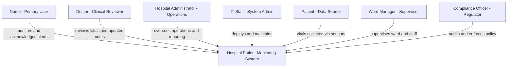

# STAKEHOLDERS.md — Stakeholder Analysis
## Hospital Patient Monitoring System (HPMS)

---

## Stakeholder Analysis Table

| # | Stakeholder | Role | Key Concerns | Pain Points | Success Metrics |
|---|---|---|---|---|---|
| 1 | **Nurse** | Primary system user; monitors patient vitals, acknowledges alerts, logs observations at the bedside | Real-time visibility into all assigned patients; fast alert acknowledgement; easy data entry | Missing critical alerts due to delayed manual checks; juggling multiple patients simultaneously; paper-based observation logs are slow and error-prone | Alert response time reduced by 40%; zero missed critical alerts; observation logging time cut by 50% |
| 2 | **Doctor** | Reviews patient vitals and history; updates treatment plans; receives escalated critical alerts | Instant access to patient trends and history; ability to update treatment notes remotely; reliable escalation of life-threatening readings | Lack of consolidated patient view across systems; delayed notification of critical changes; time wasted chasing nurses for verbal updates | Patient review time reduced by 30%; critical alerts reach doctor within 60 seconds of threshold breach |
| 3 | **Hospital Administrator** | Oversees hospital operations; manages ward capacity, staffing, and compliance reporting | System reliability and uptime; compliance with data privacy regulations; ward-level performance dashboards | No centralized view of ward status; manual compliance reporting is time-consuming; difficulty tracking alert response times across staff | 99.5% system uptime; compliance reports generated automatically; ward occupancy visible in real time |
| 4 | **IT Staff / System Admin** | Deploys, maintains, and secures the system infrastructure; manages user accounts and system configuration | System stability, security, and ease of maintenance; clear documentation; minimal downtime during updates | Poorly documented legacy systems; difficult rollback procedures; security vulnerabilities in older monitoring tools | Deployment time under 2 hours; zero critical security incidents; system updates achievable with less than 10 minutes downtime |
| 5 | **Patient** | Passive data source; vitals collected via bedside sensors; indirectly benefits from timely clinical responses | Privacy of personal health data; accurate monitoring leading to timely care | Unaware of monitoring gaps; anxiety caused by false alarms triggering unnecessary interventions | No unauthorized data access incidents; false alarm rate below 5% |
| 6 | **Ward Manager** | Supervises nursing staff on a ward; responsible for ward-level patient safety and staff coordination | Real-time ward overview; staff alert workload distribution; ability to generate shift reports | No single view of all patients on the ward; manual shift handover reports; difficulty identifying which nurses are overloaded | Shift handover report generation time reduced by 60%; ward-level alert backlog visible at a glance |
| 7 | **Compliance / Data Privacy Officer** | Ensures the system meets healthcare data regulations (HIPAA-aligned); audits data access logs | Data encryption, audit trails, role-based access controls; data retention policies | No automated audit logs in current systems; risk of unauthorized access to patient records; unclear data retention policies | 100% of data access logged and auditable; all patient data encrypted at rest and in transit |

---

## Stakeholder Relationship Map

